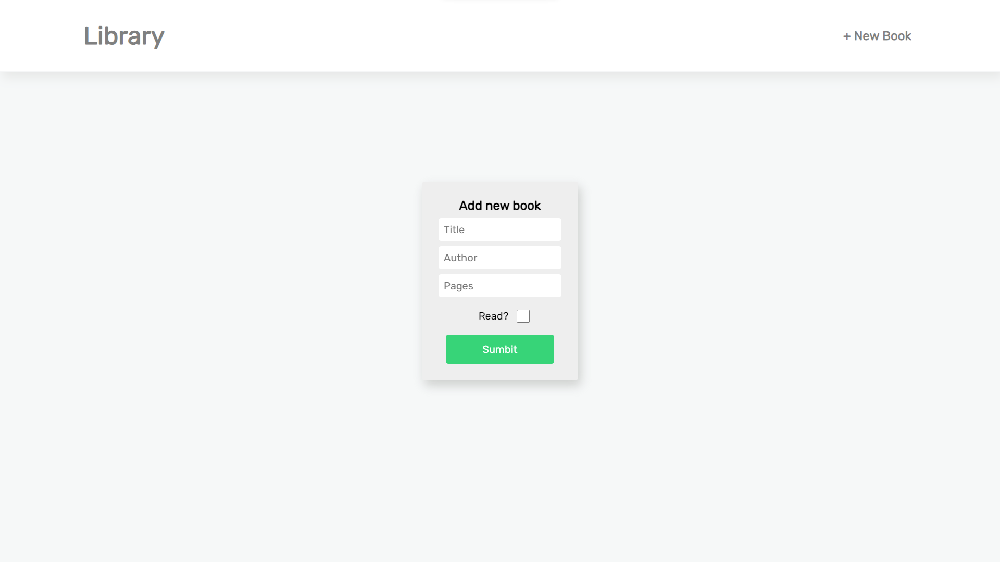

# Overview

A library app for The Odin Project!

[Live Site](https://purpleboxe.github.io/Library/)

## Preview

## The process

### Built with

- HTML5
- CSS
- JS

### What I learned

This library app has taught me how to properly develop a good workflow.
Building it from scratch seemed scary at first, but as I went deeper into building the project I had more confidence!

## Conclusion

Even though this library app took me a while to make I'm quite satisfied with the results.
This project was a pretty easy and fun one to make!